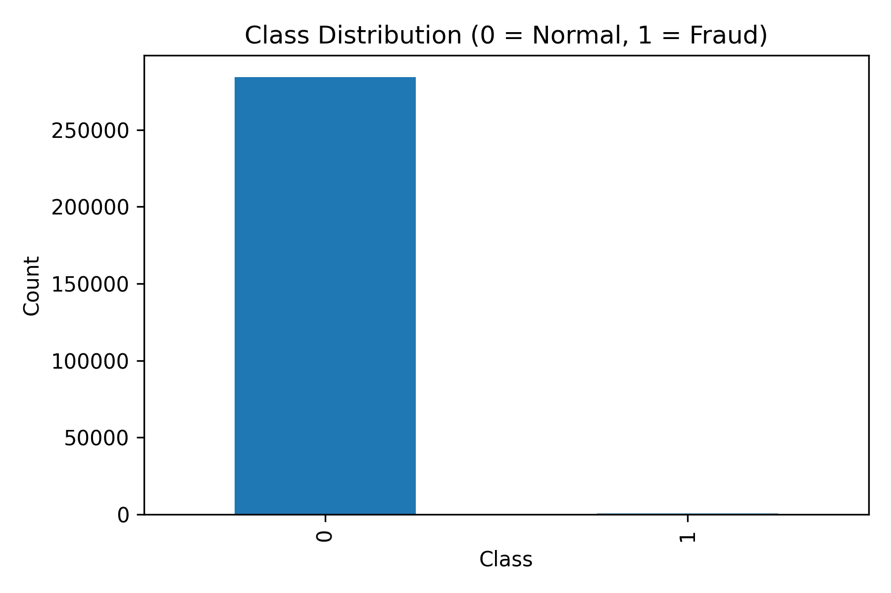
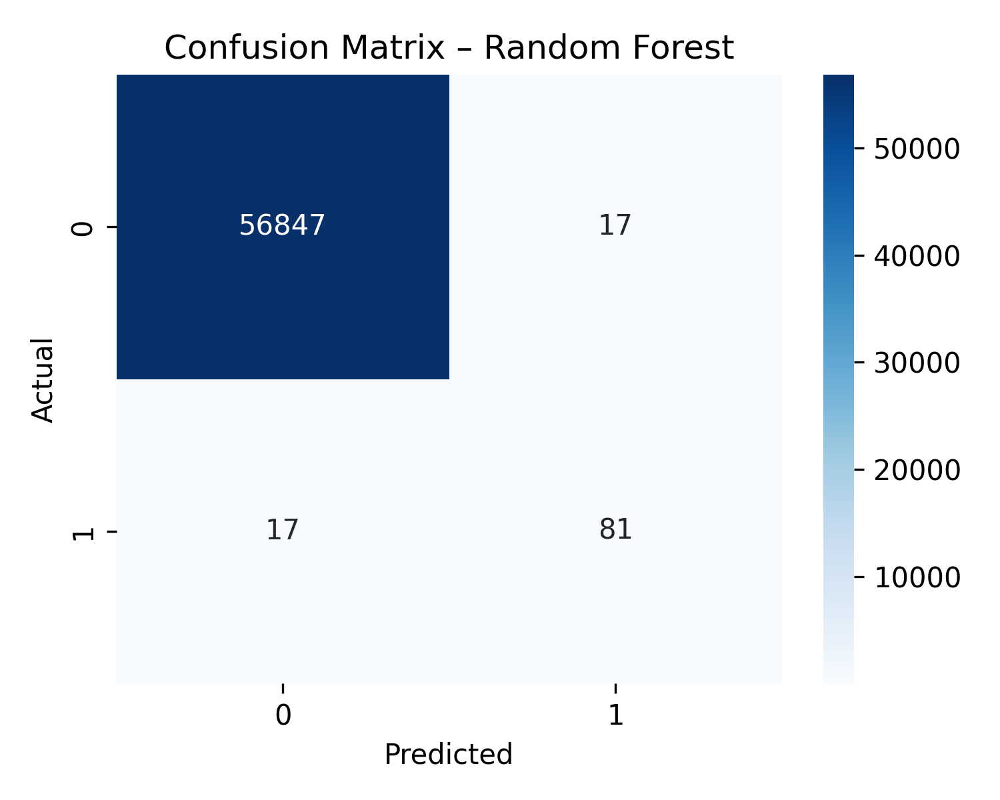
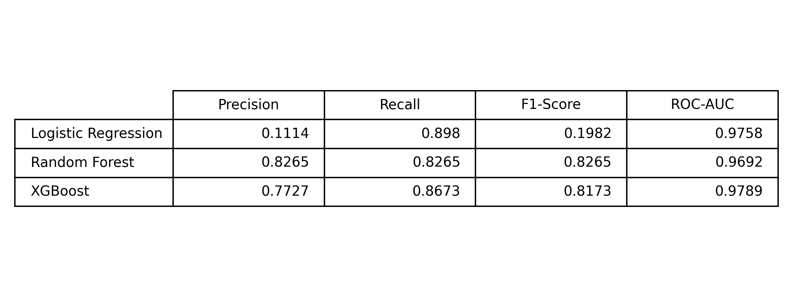

# Credit Card Fraud Detection

## Problem Statement
Credit card fraud is a major challenge in the financial sector, where fraudulent transactions are extremely rare compared to legitimate ones. This severe class imbalance makes traditional accuracy-based models ineffective. The goal of this project is to build a machine learning model that accurately detects fraudulent credit card transactions while minimizing false negatives.

---

## Dataset
- **Source:** European Credit Card Fraud Dataset (Kaggle)
- **Total Transactions:** 284,807
- **Fraud Cases:** 492 (≈ 0.17%)
- **Features:** V1–V28 (PCA-transformed), Time, Amount
- **Target Column:** Class  
  - `0` → Legitimate transaction  
  - `1` → Fraudulent transaction  

The dataset contains no missing values and is highly imbalanced.

---

## Approach

### 1. Exploratory Data Analysis (EDA)
- Analyzed class distribution to understand imbalance
- Compared transaction amounts for fraud vs normal cases
- Observed that fraud cases form a very small minority

### 2. Data Preprocessing
- Scaled the `Amount` feature using StandardScaler
- Performed stratified train-test split to preserve class ratio
- Avoided data leakage by preprocessing only training data

### 3. Handling Class Imbalance
- Applied **SMOTE (Synthetic Minority Over-sampling Technique)** on the training set
- Balanced fraud and non-fraud samples to improve model learning

### 4. Model Building
- Trained multiple models for comparison:
  - Logistic Regression (baseline)
  - Random Forest
  - XGBoost

### 5. Model Evaluation
- Used metrics suitable for imbalanced data:
  - Precision
  - Recall
  - F1-Score
  - ROC-AUC

---

## Models Used
- Logistic Regression
- Random Forest Classifier
- XGBoost Classifier

---

## Results

| Model | Precision | Recall | F1-Score | ROC-AUC |
|------|----------|--------|----------|---------|
| Logistic Regression | — | — | — | — |
| Random Forest | — | — | — | — |
| XGBoost | — | — | — | — |

> *(Replace dashes with your actual values from Phase 6)*

Random Forest and XGBoost significantly outperform Logistic Regression, especially in terms of recall.

---

## Key Insights
- Random Forest achieves the best overall performance
- SMOTE significantly improves recall for fraud detection
- Recall is prioritized over accuracy to minimize missed fraud cases
- Tree-based models capture complex transaction patterns effectively

---

## Future Improvements
- Hyperparameter tuning using GridSearchCV
- Cost-sensitive learning to penalize false negatives
- Real-time fraud detection using streaming data
- Model deployment using Streamlit or FastAPI

---

## Conclusion
This project demonstrates an end-to-end machine learning pipeline for fraud detection using real-world, highly imbalanced data. By applying proper preprocessing, imbalance handling, and evaluation metrics, the final model effectively identifies fraudulent transactions while maintaining practical usability.

